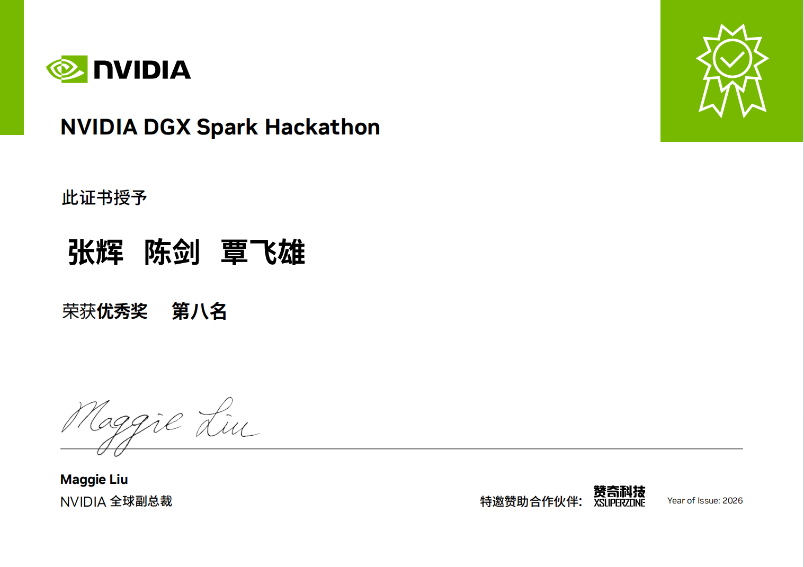

# SparkScroll

# 


**《SparkScroll》项目获Nvidia DGX Spar黑客松大赛第八名！！！**





## 📖项目简介

**项目起名：**

SparkScroll - 智能多模态内容生成与编辑平台，中文名称为”星火绘卷“。 Spark 直接致敬Nvidia DGX Spark平台，Scroll代表连环画、画卷。中文“星火绘卷”既有科技感，又有古典文学韵味。

**项目内容：**

SparkScroll是一个面向经典文学内容生成的多模态创作项目，围绕“长文本理解 -> 剧情拆解 -> 连环画分镜 -> 页面生成 -> 前端展示”构建完整闭环。

**项目看点：**

本仓库包含三部分核心能力：`gateway` 多 Agent 编排服务、`client` Streamlit 前端，以及 `localmodel` 中的本地模型部署脚本与说明。

- 多 Agent 工作流：覆盖 Director、Writer、CharacterDesigner、Drafting、Editor、Assembler 等阶段。
- 双端协作：`gateway` 提供 FastAPI 与任务编排，`client` 提供项目创建、进度追踪、结果浏览。
- 本地/远程混合模型：仓库同时保留 Qwen3.5-9B、Qwen-Image-Edit-2511、FireRed-Image-Edit-1.1 的本地部署资产，并已接入 DashScope 与 OpenAI-style vLLM 图像编辑 provider。
- 交付物齐全：包含项目报告、发布 wheel 包和流水线配置，便于演示、测试与交付。


## 📆更新说明及团队动态

[2026.4.10]   **张小白**发布《在Nvidia DGX Spark使用TensorRT-LLM部署NVIDIA-Nemotron-3-Nano-30B-A3B-NVFP4模型》：https://zhuanlan.zhihu.com/p/2025685426493506830

[2026.4.9]   **张小白**发布《在Nvidia DGX Spark使用docker部署FireRed-Image-Edit图像编辑模型服务》：https://zhuanlan.zhihu.com/p/2025459284385743751  **寒晨**发布《TensorRT-LLM模型部署NVIDIA-Nemotron-3-Nano-30B-A3B-NVFP4记录》：https://github.com/zhanghui-china/SparkScroll/blob/main/localmodel/TensorRT-LLM/NVIDIA-Nemotron-3-Nano-30B-A3B-NVFP4/README.md  **张小白**发布项目介绍视频（更新版）：https://www.bilibili.com/video/BV1JJDxBAETr/

[2026.4.8]   **张小白**发布《SparkScroll项目操作指南》：https://zhuanlan.zhihu.com/p/2024950757548401621 ，**飞哥**发布《NVIDIA 首届DGX Spark 全栈AI开发黑客松成果展示》视频：https://www.bilibili.com/video/BV1CVDjBLE7C  

[2026.4.7]   **张小白**发布项目介绍视频（初稿）：https://www.bilibili.com/video/BV1tnDiBGEDo/

[2026.4.6]   **寒晨**发布 sparkscroll_gateway 2.3.0版，升级了vllm 图片模型的API支持。**张小白**编写参赛提交文档。**飞哥**进一步进行前端联调和测试。

[2026.4.5]   **寒晨**发布 sparkscroll_gateway 2.2.2-2.2.7版。**张小白**优化前端UI对接测试代码，联调时发现本地模型"图片上的中文显示异常"的问题。**张小白**部署FireRed-Image-Edit-1.1模型替换Qwen-Image-Edit-2511本地模型进行验证，双本地模型测试成功。

[2026.4.4]   **寒晨**发布 sparkscroll_gateway 2.1.8-2.2.0版。**张小白**在Spark上部署Qwen3.5 9B模型，使用小红帽进行本地文本和远程生图的混合模型测试，解决调用模型超时BUG。**飞哥**出具项目说明和技术栈说明文档，并开始整理前端调用细节文档。**张小白**使用卖火柴的小女孩进行Gateway Spark本地部署和双本地模型联调，解决400错误，vllm启动增加MTP参数。

[2026.4.3]   **寒晨**让codex解决"敏感词通不过审核导致草图Agent歇菜"的BUG，解决"出图歇菜"的BUG，增加导演Agent的健壮性。**张小白**使用西游记第一回和第二回进行生成测试。

[2026.4.2]   项目组讨论前端调用流程。召开第二次腾讯会议。**飞哥**开始进行前端vibe coding。**张辉**基于寒晨提供的Gateway版本使用Trae进行对接UI的vibe coding和云端联调。**寒晨**让codex解决"编辑Agent歇菜"的BUG。

[2026.4.1]   **寒晨**进行Gateway代码调试。 

[2026.3.31]  **寒晨**出具项目模块设计文档，并启动codex编程。

[2026.3.30]  **张小白**建立gitee代码仓： https://gitee.com/zhanghui_china/SparkScroll  。团队成员进行目录规划和提交代码。

[2026.3.30]  **寒晨** Qwen3.5 9B 本地模型部署成功：https://zhuanlan.zhihu.com/p/2023695422703575616   **张小白** Qwen-Image-Edit-2511本地模型部署成功：https://zhuanlan.zhihu.com/p/2022011775193718931

[2026.3.29]  **纵贯线团队**全体成员参加黑客松开营活动。  

[2026.3.27]  **张小白**提供动态二级域名的ssh通道和http通道访问Nvidia DGX Spark设备的方式，供团队共享使用，并提供Spark设备物理扩容方法：https://zhuanlan.zhihu.com/p/2020920979497428602

[2026.3.26]  **寒晨**出具项目技术白皮书，并提供云端测试环境，确定使用codex进行vibe coding，初定编码过程不依赖本地算力，先用云端大模型进行调试。

[2026.3.24]  **寒晨**建议项目名称为SparkScoll（中文名：星火绘卷），被广泛接受~~

[2026.3.22]  **张小白**完成了OpenClaw多Agent的配置，建立起纵贯线团队3人（真人）+AI机器人9人的飞书群：https://zhuanlan.zhihu.com/p/2018745391802261631 。进一步对项目设想进行完善，生成项目评估报告和MVP原型图。

[2026.3.20]  **纵贯线团队**提出初步设想——录入世界经典名著小说文本，由openclaw调用skill进行文章缩写，调用本地文生图大模型生成连环画。考虑使用连环画的数据做微调以调整模型风格。 具体场景可以是 为孩子进行世界名著的普及，或者为不读书的打工人提倡"轻松读名著"的场景。

[2026.3.16]  **纵贯线团队**召开第一次视频会议，进行头脑风暴。 

[2026.3.13]  **纵贯线团队**成立，项目组由**张小白**（**张辉**、来自南京）、**寒晨**（来自北京）、**覃飞雄**（**飞哥**，来自广州）三人组成。**张小白**发布《Nvidia DGX Spark初体验》：https://zhuanlan.zhihu.com/p/2013726822618116929

[2026.3.12]  **张小白**发布《在Nvidia DGX Spark上Docker部署OpenClaw》：https://zhuanlan.zhihu.com/p/2014441844394705834


## 🗂️ 文档导航

| 路径                                                         | 说明                      |
| ------------------------------------------------------------ | ------------------------- |
| [README.md](https://github.com/zhanghui-china/SparkScroll/blob/main/README.md) | 中文总览                  |
| [README.en.md](https://github.com/zhanghui-china/SparkScroll/blob/main/README.en.md) | 英文总览                  |
| [localmodel/Qwen3.5-9B/README.md](https://github.com/zhanghui-china/SparkScroll/blob/main/localmodel/VLLM/Qwen3.5-9B/README.md) | Qwen3.5-9B 本地部署说明   |
| [localmodel/Qwen-Image-Edit-2511/README.md](https://github.com/zhanghui-china/SparkScroll/blob/main/localmodel/origin/Qwen-Image-Edit-2511/README.md) | Qwen 图像编辑模型部署说明 |
| [report/project_report.md](https://github.com/zhanghui-china/SparkScroll/blob/main/report/project_report.md) | 项目报告与参赛材料        |


## 🗺️技术架构

本项目专为 **NVIDIA DGX Spark (GB10 128G 共享显存)** 量身定制。为彻底拉开与普通消费级显卡（如 RTX 4090 24G）的差距，SparkScroll 采用了 **“重型双大模型常驻显存” (Memory-Resident Multi-Model)** 架构：

| 模块               | 选型                                                        | 显存常驻预算         | DGX Spark的绝对必要性                                        |
| :----------------- | :---------------------------------------------------------- | :------------------- | :----------------------------------------------------------- |
| **文本与逻辑主脑** | Qwen3.5-9B (实际 128K 上下文，vLLM v0.19.0 驱动)            | **~40GB**            | 128K 上下文已足以覆盖绝大多数小说全文理解，稳定支撑剧情压缩、跨集规划与结构化分镜生成。 |
| **视觉渲染中枢**   | Qwen-Image-Edit-2511 / FireRed-Image-Edit-1.1（本地双模型） | **50~60GB**          | 兼顾高保真角色一致性编辑与中文字幕渲染能力，需要为本地图片编辑模型预留足够显存。强行量化会导致排版几何推理能力丧失。 |
| **框架与并发缓冲** | vLLM v0.19.0、FastAPI、Diffusers、vLLM-Omni 适配层、OS      | **~15GB**            | 支撑 API 流转、自研调度、模型服务与图像编辑调用，需要为缓存、调度与系统运行预留安全冗余。 |
| **总计**           | --                                                          | **110~115GB / 128G** | **普通单卡系统完全无法运行该并发管线。** 只有 DGX Spark能实现"零 Swap"的极致秒级响应，支撑多 Agent 极速切换与流式呈现。 |


## ✨项目报告

【项目报告】 https://github.com/zhanghui-china/SparkScroll/blob/main/report/project_report.md


## 📋项目代码结构

```
以下结构按 2026-04-09 仓库快照整理，省略 .git、.venv、__pycache__ 等环境与缓存目录。

SparkScroll/
├── certificate/                        # 赛前证书
├── client/                             # Streamlit 前端（张小白）
│   ├── app_streamlit.py                # 前端入口
│   ├── static/                         # 静态页面资源
│   ├── generated/                      # 下载图片输出目录
│   ├── *.db                            # 本地 SQLite 数据
│   ├── 操作手册.md                      # 前端使用手册
│   └── README.md                       # 前端说明
├── client_vue/                         # Vue 前端（飞哥）  
│   ├── spark-client/                    
│   │   ├── src/                        # 核心源码
├── .workflow/                          # 分支、主干、PR 流水线配置
├── gateway/                            # 多 Agent Gateway 服务（寒晨）
│   ├── config.yaml                     # 服务配置
│   ├── docs/                           # 部署与补充文档
│   ├── examples/                       # 示例配置与调用样例
│   ├── presets/                        # 预设字体、布局、项目模板
│   ├── resource/                       # 三视图与页面模板图片
│   ├── scripts/                        # 辅助脚本
│   ├── src/sparkscroll_gateway/        # 核心源码
│   │   ├── agents/                     # Agent 定义与运行时
│   │   ├── api/                        # FastAPI 应用与接口 schema
│   │   ├── application/                # 应用层 DTO
│   │   ├── config/                     # 配置模型与加载器
│   │   ├── domain/                     # 领域模型与状态机
│   │   ├── model_gateway/              # 文本/图像模型适配层
│   │   ├── repositories/               # 文件系统与 Redis 仓储
│   │   ├── services/                   # 项目、工作流与执行服务
│   │   ├── utils/                      # 资源布局、序列化等工具
│   │   ├── workflows/                  # 工作流协调器
│   │   └── cli.py                      # CLI 入口
│   ├── tests/                          # 单元、契约、集成测试
│   ├── data/                           # 运行期缓存、日志、项目产物
│   │   ├── cache/
│   │   ├── logs/
│   │   ├── projects/
│   │   └── system_presets/
│   ├── build/                          # 构建中间产物
│   ├── dist/                           # 构建输出目录
│   ├── pyproject.toml                  # Python 打包配置
│   └── README.md                       # Gateway 说明
├── localmodel/                         # 本地模型部署脚本与说明
│   ├── origin/                         # 原生部署
│   │   ├── Qwen-Image-Edit-2511/       # 图像编辑模型原生部署：千问
│   │   ├── FireRed-Image-Edit-1.1/     # 图像编辑模型原生部署：小红书
│   ├── vllm                            # conda VLLM部署
│   │   ├── Qwen3.5-9B/                 # 文本模型vllm部署：千问
│   ├── docker/                         # docker部署
│   │   ├── Qwen3.5-9B/                 # 文本模型docker部署：千问
│   │   ├── FireRed-Image-Edit-1.1/     # 图像编辑模型docker部署：小红书
│   ├── TensorRT-LLM/                   # TensorRT-LLM docker部署
│   │   ├── NVIDIA-Nemotron-3-Nano-30B-A3B-NVFP4/     # 文本模型：NVIDIA-Nemotron-3-Nano
├── release/                            # 已构建的 sparkscroll_gateway wheel 包
├── report/                             # 项目报告
├── ppt/                                # 项目演讲稿        
├── nvidia-logo.png                     # 致谢资源
├── gpus-logo.png                       # 致谢资源
├── zanqi-logo.png                      # 致谢资源
├── README.md                           # 中文文档
├── README.en.md                        # 英文文档
└── LICENSE                             # Apache License 2.0
```


##  🚀 快速开始

### 1. 启动 Gateway

```
cd gateway
python3 -m venv .venv
source .venv/bin/activate
python3 -m pip install -e .[dev]
export SPARKSCROLL_API_KEY=...
export SPARKSCROLL_TEXT_API_KEY=...
export SPARKSCROLL_IMAGE_API_KEY=...
python3 -m sparkscroll_gateway --config ./config.yaml --reload
```

### 2. 启动前端

```
cd client
python3 -m pip install streamlit requests
streamlit run app_streamlit.py
```

启动前请在 `client/app_streamlit.py` 中确认 `GATEWAY_BASE_URL` 与 `API_KEY` 配置正确；如需部署本地文本/图像模型，请先参考 `localmodel/` 下的部署脚本和说明。


## ☕项目团队——纵贯线

团队起名叫做"纵贯线"，源自团队成员来自于北京-南京-广州三地，像一条纵贯国家的线。

BTW：中国台湾的纵贯线（Super Band）乐队由[罗大佑](https://baike.baidu.com/item/罗大佑/236869?fromModule=lemma_inlink)、[李宗盛](https://baike.baidu.com/item/李宗盛/438185?fromModule=lemma_inlink)、[周华健](https://baike.baidu.com/item/周华健/6700?fromModule=lemma_inlink)、[张震岳](https://baike.baidu.com/item/张震岳/440264?fromModule=lemma_inlink)组成。

| 成员   | 职责                     | 贡献                                                         |
| ------ | ------------------------ | ------------------------------------------------------------ |
| 张小白 | 队长、项目策划           | 项目场景策划、项目管理和团队沟通，Qwen3.5-9B和Qwen-Image-Edit-2511模型的本地部署和服务化，前端UI开发和调试 |
| 寒晨   | 队员、架构设计、代码负责 | 设计系统整体架构，制定技术路线图，协调各模块开发，Gateway开发负责人 |
| 覃飞雄 | 队员、测试与文档         | 前端UI开发和调试、系统测试、技术文档、参赛资料编写等         |
| Codex  | Gateway服务端开发        | 设计和实现后端API服务                                        |
| Trae   | 前端UI开发               | 设计用户友好的前端界面，提供直观的模型操作入口               |


## 💖特别鸣谢

感谢 Nvidia 主办本次黑客松活动


感谢 GPUS开发者 提供赛事支持


感谢 赞奇科技 提供比赛设备支持


## 开源协议

本项目采用 [Apache License 2.0 开源许可证](https://github.com/SmartFlowAI/TheGodOfCookery/blob/main/LICENSE)。