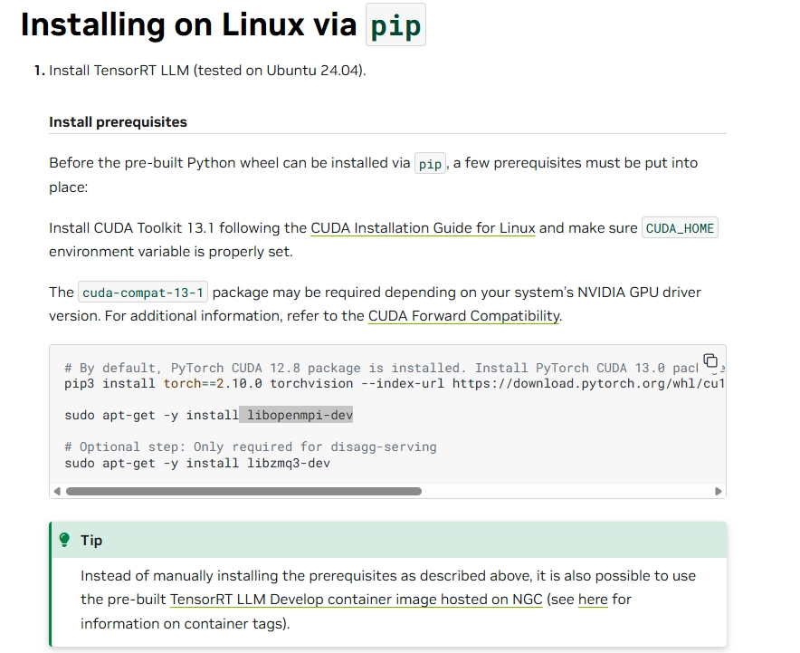
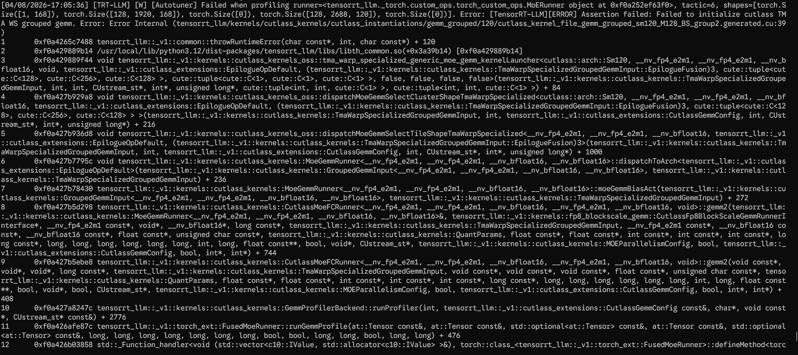
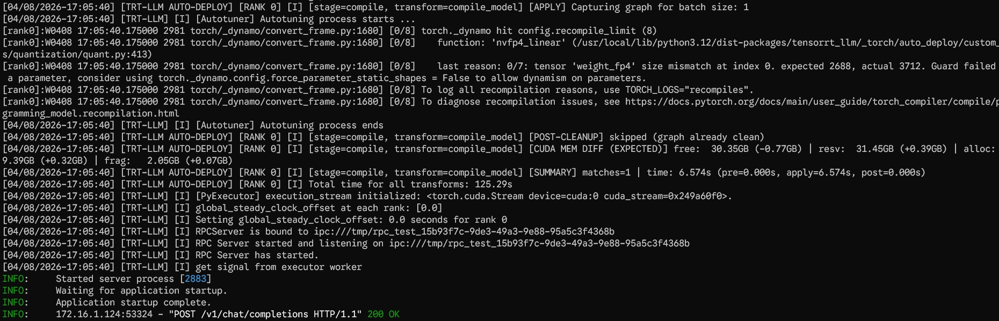
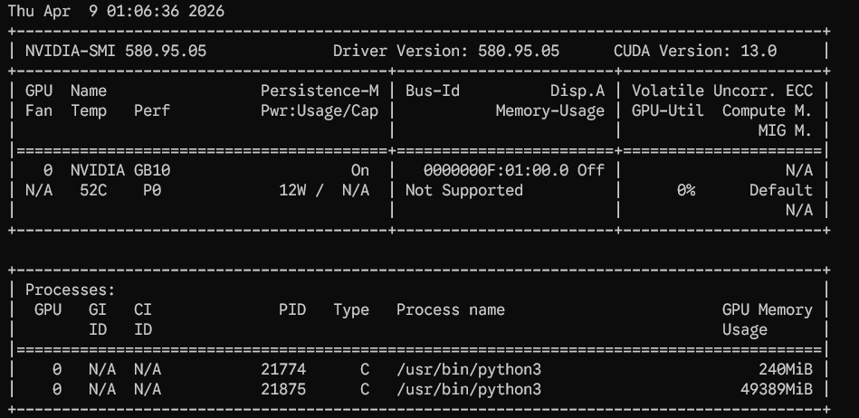
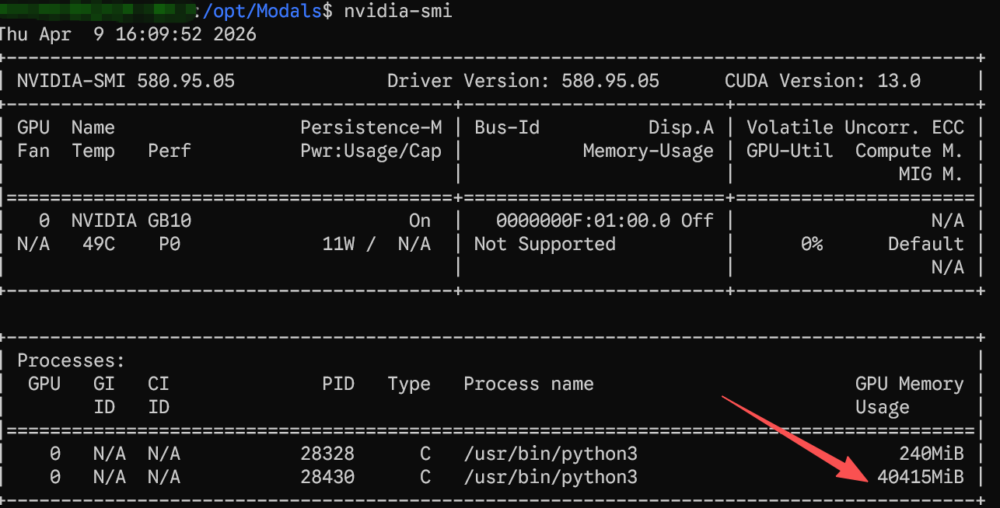
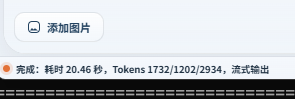

# TensorRT-LLM模型部署NVIDIA-Nemotron-3-Nano-30B-A3B-NVFP4记录

**作者：寒晨**

## 背景

这次的目标，是在 DGX Spark 上快速试用 TensorRT-LLM，并验证基于 NVIDIA 官方模型的实际部署效果。

一开始我原本打算直接在 Spark 上从源码构建，顺带把镜像也一起做出来。考虑到TensorRT-LLM 对 CUDA、PyTorch、通信库和编译环境都比较敏感，我判断如果能基于 NVIDIA 官方的 PyTorch 镜像继续搭建，理论上可以少踩不少兼容性问题。事实证明，这个判断还是有点过于乐观了。。

## 1.目标和思路

这次尝试主要想验证三件事：

- TensorRT-LLM 能否在 DGX Spark 上顺利跑起来
- Qwen3.5 / NVFP4 相关能力是否已经在当前版本中可用
- 如果构建成本过高，是否可以直接切换到官方镜像完成试用

从项目发布日志来看，最新的1.3.0rc10版本已经支持 Qwen3.5 NVFP4，而这正是当前阶段比较需要验证的能力，因此最终选用了这个版本。


## 2. 前期调研

在正式动手之前 ，先看了官方文档 ，重点确认了两条路径 ：

- 通过 pip 在 Linux 环境中安装
- 在 Linux 上从源码进行完整构建

相关文档 ：

·  [Installing on Linux via pip — TensorRT LLM](https://nvidia.github.io/TensorRT-LLM/installation/linux.html)

·  [Building from Source Code on Linux — TensorRT LLM](https://nvidia.github.io/TensorRT-LLM/installation/build-from-source-linux.html)

同时也参考了 NVIDIA 的官方 PyTorch 容器 ，希望尽量站在一个已经处理好 CUDA / PyTorch 基础依赖的环境上继续向前搭建 ：

·  [PyTorch | NVIDIA NGC](https://catalog.ngc.nvidia.com/orgs/nvidia/containers/pytorch?version=26.03-py3)


## 3. 第一条路线 ：尝试自行构建镜像

最初的方案 ，是基于 NVIDIA 官方 PyTorch 镜像继续构建 TensorRT_LLM。




以下是当时使用的 Dockerfile ：

```bash
FROM nvcr.io/nvidia/pytorch:26.03-py3

#ENV PIP_INDEX_URL="https://mirrors.aliyun.com/pypi/simpl e/"

RUN apt update && apt install -y --no-install-recommends li bzmq5 libzmq3-dev  \
&& rm -rf /var/lib/apt/lists/*

RUN pip install -U pip setuptools setuptools-scm

WORKDIR /workspace/
COPY ./v1.3.0rc10.tar.gz TensorRT-LLM-1.3.0rc10.tar.gz RUN tar -xvzf TensorRT-LLM-1.3.0rc10.tar.gz
WORKDIR /workspace/TensorRT-LLM-1.3.0rc10/

RUN pip install -r requirements.txt
RUN python ./scripts/build_wheel.py --cuda_architectures "9 0-real" --build_type Release

ENTRYPOINT ["/bin/sh"]
```

### 3.1 第一个坑：通信库冲突

这里一开始埋下了一个比较隐蔽的问题。

如果额外安装  libopenmpi-dev ，会和 PyTorch 官方镜像里已经配置好的通信库发生冲突 ，最终导致  import torch 直接失败。

这个问题的⿇烦之处在于 ：它不是在构建阶段立即暴露 ，而是到了运行时才明显报错 ，因此排查成本并不低。

### 3.2 第二个坑：缺少静态库依赖

随后又遇到了第二个关键问题 ：构建过程中缺少静态库CUDA : :nv rtc_static 依赖

[Issue]: https://github.com/NVIDIA/TensorRTLLM/issues/5741

从官方资料来看 ，这类问题的推荐解法并不是继续在通用运行容器里硬补依赖，而是切换到 NVIDIA 预先准备好的“专用构建容器” 中完成编译。 问题在于 ，这相当于还要先处理一层“构建构建环境” 的工作 ，整体投入开始迅速上升。

综合考虑之后 ，这条路线就暂时放弃了。对这次目标来说 ，重点是尽快验证运行效果 ，而不是为了完整复现一条成本很高的源码构建链路。


## 4. 第二条路线：直接使用官方发布镜像

既然自行构建的复杂度明显偏高 ，于是转而查找 NVIDIA 是否已经提供了可直接使用的官方镜像。结果比较理想 ：官方确实已经提供了  1 .3 .0rc10 版本镜像 ，可以直接拉取试用：

·  [TensorRT LLM Release | NVIDIA NGC](https://catalog.ngc.nvidia.com/orgs/nvidia/teams/tensorrt-llm/containers/release?version=1.3.0rc10)

```bash
docker pull nvcr.io/nvidia/tensort-llm/release:1.3.0rc10
```

这一步基本把前面大量的环境兼容问题直接绕开了 ，也让验证工作重新回到“模型能否顺利部署与推理” 的主线。

## 5. 模型与配置选择

接下来准备直接使用 NVIDIA 提供的模型资源。这里使用的是 ：

NVIDIA-Nemotron-3-Nano-30B-A3B-NVFP4

为了找到对应的优化配置 ，我从官方版本库里找到了 nano_v3 .yaml 。默认配置支持64K 上下文长度 ，整体已经比较完整 ，后续更多是结合实际显存 / 统一内存情况做取舍。

```bash
runtime: trtllm
compile_backend: torch-cudagraph
max_batch_size: 384 # 这个并发应该要降下来，实际未优化
max_seq_len: 65536 # 上下文  64K
enable_chunked_prefill: true
attn_backend: flashinfer
model_factory: AutoModelForCausalLM
skip_loading_weights: false
cuda_graph_batch_sizes: [1, 2, 4, 8, 16, 24, 32, 64, 128, 2
56, 320, 384]
kv_cache_config:
  free_gpu_memory_fraction: 0.35 # 压缩统一内存使用
transforms:
  detect_sharding:
    allreduce_strategy: 'SYMM_MEM'
    sharding_dims: ['ep', 'bmm']
    manual_config:
      head_dim: 128
      tp_plan:
        # mamba SSM layer
        "in_proj": "mamba"
        "out_proj": "rowwise"
        # attention layer
        "q_proj": "colwise"
        "k_proj": "colwise"
        "v_proj": "colwise"
        "o_proj": "rowwise"
        # NOTE: consider not sharding shared experts and/or
        # latent projections at all, keeping them replicate d.
        # To do so, comment out the corresponding entries.
        # moe layer: SHARED experts
        "up_proj": "colwise"
        "down_proj": "rowwise"
        # MoLE: latent projections: simple shard
        "fc1_latent_proj": "gather"
        "fc2_latent_proj": "gather"
  multi_stream_moe:
    stage: compile
    enabled: true
  gather_logits_before_lm_head:
    enabled: true
  fuse_mamba_a_log:
    stage: post_load_fusion
    enabled: tru
```

另外 ，在文档中也看到了与“思考内容展⽰ ”和 “工具调用解析器”相关的参数，最终使用了 ：

```bash
--reasoning_parser nano-v3 --tool_parser qwen3_code r
```

## 6. 启动方式

为了方便调试 ，这里把启动分成了两个阶段 ：先拉起容器 ，再在容器内执行服务命令。

### 6.1 启动容器

```bash
docker run --rm -it --ipc=host --ulimit memlock=-1 --ulimit stack=67108864 --gpus=all -v /opt/Modals:/mnt/ -p 0.0.0.0:8 080:8080/tcp nvcr.io/nvidia/tensorrt-llm/release:1.3.0rc10
```

### 6.2 启动服务

```bash
trtllm-serve ./NVIDIA-Nemotron-3-Nano-30B-A3B-NVFP4 --host 0.0.0.0 --port 8080 --trust_remote_code --backend _autodepl oy --extra_llm_api_options ./nano_v3.yaml --reasoning_parse r nano-v3 --tool_parser qwen3_code r --served_model_name DGX -Nemotron-3-Nano-30B-A3B
```

## 7. 启动过程中的现象

服务启动过程中出现了一些告警和错误日志。初步判断 ，这些信息更像是与微调或某些扩展能力相关 ，并没有直接阻断推理服务启动 ；至少从后续实际调用结果来看，模型本身是可以正常使用的。

不过 ，这里仍然建议保留一个判断 ：**看起来不影响使用并不等于可以完全忽略**。如果后续要进入更正式的部署阶段 ，还是需要进一步确认这些日志究竟对应什么模 块 ，避免在并发、长上下文或工具调用场景下出现隐性问题。




启动命令日志末尾如下 ：




## 8. 实测资源占用与性能

经过简单优化后的实测结果看 ，这个模型大约需要 50GB 统一内存。



经过优化后，占用40GB统一内存：



从性能上看 ，A3B 的运行速度非常亮眼 ，实测可以达到 60 tokens/s 以上。




## 9. 最终结论

这次试用的结论比较明确 ：

- **优点** ：模型运行速度非常快 ，单模型推理性能表现突出
- **问题** ：资源占用依然偏大 ，实测约需要 50GB 统一内存
- **工程结论** ：从源码自行构建镜像的成本较高 ，直接使用官方镜像是更高效的路径
- **部署结论** ：适合做单模型高性能验证 ，但暂时不太适合承载“双模型并发”这类资源需求更高的场景

整体来说 ，这次验证说明 TensorRT_LLM 在 DGX Spark 上是可以较快跑通的，尤其适合做高性能推理能力验证 ；但如果目标是进一步走向稳定服务化、并发部署或多模型共存 ，接下来就需要继续优化内存占用 、批量配置 ，以及接口层面的稳定性表现。