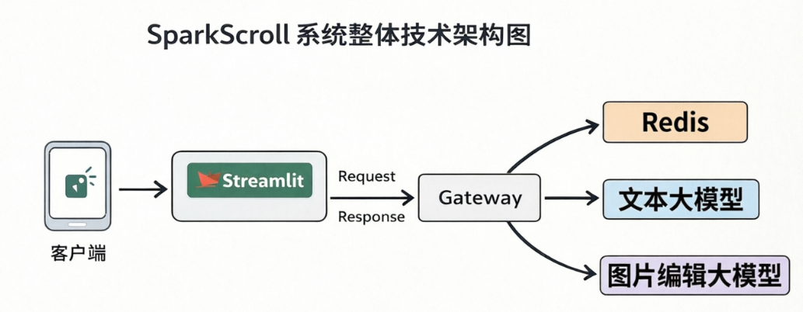

# SparkScroll Project Report

## 1. Project Overview

### 1.1 Project Name
SparkScroll - Intelligent Multi-Modal Content Generation and Editing Platform, Chinese name is "星火绘卷" (Xing Huo Hui Juan). "Spark" directly pays tribute to the NVIDIA DGX Spark platform, and "Scroll" represents comics and picture scrolls. The Chinese name "星火绘卷" combines both a sense of technology and classical literary charm.

### 1.2 Project Objectives
Develop an intelligent multi-modal content generation and editing platform based on NVIDIA GPU acceleration, with gpt-5.4's planning capabilities and self-developed Agent calling logic and scheduling implementation as the core, integrating advanced large language models and image editing models to provide users with efficient, high-quality content creation tools.

The platform can input long story texts, through a multi-Agent collaborative system, automatically perform plot compression, storyboard breakdown, character design, high-fidelity image rendering and post-production layout, and finally output multi-page comic strips with high character consistency in a streaming manner.

### 1.3 Project Background
At the critical historical node where global artificial intelligence technology is evolving from single-dimensional text dialogue to multi-modal, multi-agent (Multi-Agent) deep collaboration, the digital content creation industry is undergoing an unprecedented productivity reconstruction. For a long time, the traditional comic, manga, and graphic novel publishing industry has been constrained by extremely high labor costs, long production cycles, and insurmountable professional painting skill barriers. With the rapid development of AI technology, **multi-modal content generation** has become an important trend in the content creation field.

However, existing content generation tools often have the following problems:

- Single-modal functional limitations, unable to meet multi-scenario needs
- High computing resource requirements, ordinary devices difficult to run smoothly
- Complex model deployment, high user usage threshold
- Uneven generation quality, lack of professionalism

The SparkScroll project was born to solve these pain points, relying on the powerful computing power of the NVIDIA DGX Spark platform to achieve efficient, high-quality multi-modal content generation.

### 1.4 Practical Problems to Be Solved by the Project
"Breaking through with computing power, AI landing" is the fundamental purpose of this NVIDIA DGX Spark Full-Stack AI Development Hackathon. The broad applications of SparkScroll in actual production and life are the flesh and blood that give the project its soul. It is not just a "comic auto-drawing" tool, but a bottom-level revolution that reshapes cultural inheritance, educational popularization, and content business models.

1. Reduce the threshold for using AI models, allowing ordinary users to easily use advanced AI models
2. Provide a one-stop multi-modal content generation solution, covering text and image editing
3. Utilize NVIDIA GPU acceleration technology to improve model inference speed and efficiency
4. Ensure the quality and professionalism of generated content, meeting commercial application needs

#### 1.4.1 K-12 Smart Education and "Classical Masterpiece Companion Reading" for Chinese Language

**Pain Point Status:** In the current Chinese language education system, classic masterpieces such as "Dream of the Red Chamber" and "Water Margin" are required reading. However, the obscure vocabulary of classical Chinese, complex characters, and heavy pure text form easily cause middle and primary school students to feel intimidated and read superficially.

**Spark Implementation:** Imagine in a modern classroom, when a Chinese teacher is preparing lessons, they only need to directly input the original classical Chinese text of "Three Attacks on the White Bone Demon" from "Journey to the West" into the SparkScroll web backend. During a few minutes of recess, the DGX Spark will buzz and transform the obscure text into dozens of pages of comic strips with unified style and exquisite lines. The teacher projects these visualized teaching materials onto the big screen, helping students instantly build cross-era scene cognition through visualized images combined with simplified original narrations. Research in educational psychology's "Dual Coding Theory" shows that this process of visualizing classical literature can increase students' knowledge retention and thematic understanding by nearly 40% .

#### 1.4.2 Rapid Defensive Incubation of Online Literature IP and Social Media Visual Promotion

**Pain Point Status:** Authors on online literature platforms such as Yuewen and Jinjiang need to maintain daily updates of thousands or even tens of thousands of words. However, the cycle of converting these popular literary IPs into comics or animations usually takes months to years, and the production cost of each page of professional comics is as high as $150 to $300 . A large number of high-quality mid-tier online literature IPs miss the opportunity for visual comic adaptation due to expensive startup funds, making it difficult to effectively promote in the short video era.

**Spark Implementation:** Independent novelists or small and medium-sized IP incubation studios can use SparkScroll as a tool for "defensive IP development." During the novel serialization period, authors only need to import the updated chapters into the engine every day. SparkScroll will automatically extract the characteristics of newly appearing characters in the background and generate corresponding 5-10 pages of dynamic comic strips or webtoons within a few hours. These "visual slices" generated by AI at high speed can be directly used as promotional materials and posted on social media platforms such as Douyin and Xiaohongshu for low-cost traffic acquisition. The extremely low marginal computing cost enables individual creators to have the daily comic adaptation capability comparable to large animation industrial pipelines for the first time.

#### 1.4.3 Digital Cultural Expo Curation and Living Exhibitions of Local Cultural Heritage

**Pain Point Status:** Museums and local chronicles exhibition halls often face a severe lack of visual assets when conducting digital curation of ancient folk legends, county chronicles, or major historical battles. If hiring artificial painters to draw long scrolls, not only is historical research cumbersome, but also costly, resulting in many precious intangible cultural heritage stories being presented only in boring text panels.

**Spark Implementation:** Museum curators can input obscure and tedious local chronicles or ancient texts into the engine. Combined with the high-fidelity style transfer capabilities of local Qwen-Image-Edit-2511, or the supplementary advantages of FireRed-Image-Edit-1.1 in Chinese text rendering scenarios (for example, specifying "Song Dynasty ink freehand style" or "Republic of China woodcut style" in system parameters), SparkScroll can relatively accurately restore historical scenes and generate a historical comic scroll containing hundreds of storyboards within dozens of minutes. Combined with multi-touch interactive large screens in the exhibition hall, visitors can "read" this dynamically generated historical scroll by sliding the screen, achieving true digitalization, livingization, and immersive experience of cultural assets.

#### 1.4.4 Brand Globalization and Cross-Cultural Commercial Advertising Rapid Response

**Pain Point Status:** Globalized enterprises often face huge differences in language barriers and audience cultural contexts when conducting cross-national marketing. Traditional advertising short films and commercial comics have long production cycles, which are completely unable to adapt to the fleeting communication rhythm of the social media era.

**Spark Implementation:** Multinational marketing teams only need to input a general brand story or product placement copy, and SparkScroll can quickly generate attractive comic strip materials (with American comic or Japanese Manga styles freely switchable). In the current version, cross-language copy and subtitle text on images are mainly rendered directly by the image model; among them, FireRed-Image-Edit-1.1 has particularly outstanding performance in Chinese subtitle rendering. An independent Editor System in the Gateway has reserved interfaces and scheduling positions, but it is still under development and not yet enabled in the main link; after this system is completed, text and base images can be further completely decoupled to achieve more stable multilingual rearrangement.

#### 1.4.5 From Technical Reconstruction to Chinese Cultural Revival - Recasting the Digital Monument of Comic (Xiaoren Shu) Craftsmanship

In the 1980s, China's comic (commonly known as "Xiaoren Shu") industry once created an astonishing cultural miracle with an annual printing volume of up to 8.1 billion copies, carrying the enlightenment memories of several generations. However, with the impact of television, internet multimedia, and the extremely high technical threshold and increasingly high labor costs of hand-drawn comics, this publishing industry with strong national characteristics has gradually declined, even断层. The birth of SparkScroll is essentially reconstructing this lost cultural industrial production line in the digital world with the super computing power of modern artificial intelligence. It proves to the world that AI is not only a cold efficiency replacement tool but also a bridge connecting history and the future. It allows the narrative art of "Xiaoren Shu" with a sense of era to be reborn in a new digital form in the 21st century.

#### 1.4.6 A Great Boon for Content Creators

Traditional comic and publication production is a typical highly labor-intensive industry. The birth of a work requires the collaboration of multiple complex工种, including screenwriter, main artist (line drawing), coloring, lettering, and proofreading. According to industry statistics, the cost of a professional comic is usually between $100 and $300, taking several days. SparkScroll completely breaks through this value chain. Relying on the high efficiency of the GB10 chip on the DGX Spark platform, the depreciation and electricity cost of single-page comic generation is compressed to near zero.

This transformation raises the entry threshold for content creators from the brutal "underlying painting technique training" to a more pure "aesthetic judgment and narrative direction" level. In this new era, any text creator with an excellent story can become an independent publisher with the help of DGX Spark. This paradigm shift from relying on human intensive labor to silicon-based computing power marks a profound industrial revolution in the global digital publishing market.

## 2. Work Description

### 2.1 Work Highlights

**2.1.1 DGX Spark Platform Exclusive Optimization, Extreme Performance Leadership**

Traditional consumer-grade computing platforms (such as the top graphics card RTX 4090 with 24GB memory, or multi-card environments bridged through PCIe bus) face insurmountable "memory wall" and "data transmission bottlenecks" when processing multi-modal, long-context industrial-grade multi-agent streaming distribution. In traditional architectures, when multiple large language models and diffusion models need to work alternately, insufficient memory capacity forces the system to frequently unload and load model weights between video memory (VRAM) and system memory (RAM) (Swap). This data transfer across the PCIe bus causes cliff-like latency, and when processing ultra-long contexts (such as above 100K), the decay in prompt processing speed can reach up to 64 times.

The GB10 (Grace Blackwell) super chip搭载 on DGX Spark completely eliminates this bottleneck from the physical level. GB10 adopts an innovative SoC design, tightly integrating Grace CPU and Blackwell GPU through NVLink-C2C technology, achieving bidirectional inter-chip communication bandwidth of up to 900 GB/s. More crucially, the platform provides 128GB of LPDDR5x unified memory with a memory bandwidth of 273 GB/s, allowing CPU and GPU to share the same physical memory addressing space. This means that when the inference engine processes massive text KV caches and huge diffusion model latent space tensors, it achieves true "zero data copy", thus supporting rapid rotation interaction between multi-agents.

The SparkScroll project is specifically tailored for NVIDIA DGX Spark (GB10 128G unified memory), adopting a "heavy dual large model resident memory" architecture with a total memory usage of about 115GB. Ordinary single-card systems cannot run this concurrent pipeline at all. Only NVIDIA DGX Spark can achieve **"zero Swap"** extreme response, supporting multi-Agent rapid switching and streaming presentation, **completely widening the gap with ordinary consumer-grade graphics cards**.

**2.1.2 Highly还原 Industrial Publishing Process**

Abandoning the simple end-to-end black box, based on self-developed six-stage Agent runtime to还原 the human industrial publishing process, covering Director Agent, Writer Agent, CharacterDesigner Agent, Drafting Agent, Editor Agent, and Assembler Agent six stages. Among them, Editor/Assembler has been integrated into the Gateway runtime, but currently version 1.0 still runs in a pass-through loop form.

**2.1.3 Character Consistency and Content Quality Assurance**

By pre-generating character reference images through the CharacterDesigner Agent, the problem of "character incoherence" in AI drawing is solved; text rendering in the current version is mainly completed directly by the image model, among which FireRed-Image-Edit-1.1 performs prominently in Chinese subtitle rendering. Later, pure code can be used for post-production lettering, rejecting AI character garbled characters, ensuring content quality.

**2.1.4 Multi-Modal Integration and Good Scalability**

Qwen3.5-9B is used on the text side, and two local models Qwen-Image-Edit-2511 and FireRed-Image-Edit-1.1 are supported on the image side; the driver layer supports both Diffusers (stable) and vLLM-Omni (fast), and it is easy to switch between local and cloud models through a unified provider contract.

**2.1.5 Local Model Deployment**

Support local model deployment, ensuring data privacy and offline usage capability.

### 2.2 Work Functions

#### 2.2.1 Core Functions

Input long story (such as world classic masterpieces) text, through a multi-Agent collaborative system automatically complete plot compression, storyboard breakdown, character design and page generation, and finally output multi-page comic strips with high character consistency in a page-by-page streaming manner. The independent Editor System is still under development, and the main display link at this stage mainly uses the image model to complete text rendering.

#### 2.2.2 Function Module Description

| Function Module | Specific Description |
| -------------- | -------------------- |
| **Director Agent** | Performs "dimensionality reduction compression" on the original long text, eliminating redundant subplots, streamlining core characters and key scenes, and extracting a compact main script. |
| **Writer Agent** | Performs visual "shot splitting" on the director's script, planning 4-6 scenes per page, controlling the entire comic strip within 20 pages, and outputting a standardized JSON script (including scene descriptions, blank coordinate estimates, and dialogue). |
| **CharacterDesigner Agent** | Before formal storyboard drawing, based on the character list set by the director, pre-draw "core character three views" and "key object diagrams" to provide style alignment benchmarks for subsequent storyboards. |
| **Drafting Agent** | Receives the screenwriter's JSON storyboard Prompt and the character reference images from the CharacterDesigner Agent, reserves "composition blank space" when generating images, and merges and outputs the basic images for each page. |
| **Editor & Assembler Agent** | Under development, not yet enabled in the current main link. At this stage, Chinese text rendering is mainly completed directly by the image model. Later, it will read the dialogue text and coordinates in the screenwriter's JSON through pure code, load Chinese font templates, and perfectly render the text to the blank areas reserved by the Drafting Agent. |
| **Streaming Presentation** | The frontend adopts a "streaming page-by-page presentation" strategy, pushing each generated page to the frontend for users to browse immediately, ideally generating a coherent PDF album. |

#### 2.2.3 Function Planning Principles (Planning Principles)

1. **First打通主链路**：Prioritize ensuring the "text access -> director -> screenwriter -> page production -> preview" closed loop is operational.
2. **First保证一致性，再扩能力**：Prioritize solving character consistency, page readability, and state recoverability.
3. **严格沿用既有术语**：Unify the use of existing terminology such as `project_id`, `episode`, `page`, `/api/v1`, `CREATED/READY/RUNNING/...`.
4. **按资源约束设计**：Follow the basic constraints of 1 concurrency for text models, 1 concurrency for image models, and cross-modal parallelism.

#### 2.2.4 Function Panorama and Priority (Feature Map)

| Function Domain | Key Capability | Priority | Target Version |
| :-------------- | :------------- | :------- | :------------- |
| Project Access | Project creation, original text import, parameter verification, resource directory initialization | P0 | MVP |
| Text Processing | Semantic protection segmentation, fragment summarization, slice metadata landing | P0 | MVP |
| Text Agent | Director single episode planning, screenwriter storyboard JSON generation | P0 | MVP |
| Operation Monitoring | Project status query, Agent progress feedback, basic logs | P0 | MVP |
| Character Consistency | Character resource library, character reference image generation, character configuration JSON | P1 | Beta |
| Page Generation | Draft base image, composition blank space, page asset management | P1 | Beta |
| Post-production Layout | Editor System under development; currently text rendering verification completed by image model | P1 | Beta |
| Operation Control | Stop, resume, breakpoint continuation, safe exit | P1 | Beta |
| Page Presentation | Page query, page-by-page streaming preview, status filtering | P1 | Beta |
| Prompt Governance | Prompt unified registration, version management, task snapshot | P1 | V1 |
| Engineering Governance | Audit logs, tracking fields, resource isolation, cloud degradation instructions | P2 | V1 |
| Extended Output | PDF album export, complex backend management, multi-person collaboration | P2 | V1+ |

#### 2.2.5 Six-Stage Industrial Workflow In-depth Analysis

Traditional AI comic generation mostly stays at the "player-level" **prompt card drawing stage, lacking the ability for long serialization**. SparkScroll refers to modern animation industry pipelines, splits the creative process into six stages, and implements it as a recoverable episode-by-episode workflow in the Gateway. This multi-agent collaborative system demonstrates high engineering rigor under the powerful computing power of DGX Spark.

**(1) Stage 1: Multi-source Text Intake and Lifecycle Monitoring (Monitor System)**

Users import original text of million-word classical masterpieces (such as "Journey to the West") into the system. Gateway is responsible for performing segmentation, project initialization, and Redis runtime registration. At this time, the **Monitor System (monitoring scheduler)** at the global high point begins to intervene. It not only is responsible for allocating computing power priorities in complex asynchronous task pools, but also continuously pushes real-time system state event streams to the frontend through FastAPI interfaces (such as: "Second chapter data loading completed", "Original director is extracting character lines"). This transparent monitoring mechanism greatly alleviates user waiting anxiety when executing large processing tasks lasting tens of minutes.

**(2) Stage 2: Ultra-long Text Dimensionality Reduction and Purification (Director Agent)**

When facing classical literature, AI is often overwhelmed by its complex poetry, redundant environmental descriptions, and interlaced subplots. To this end, the **Director Agent** based on Qwen3.5-9B启动了长文本压缩工作，项目实测采用128k 上下文，它已经足以在不丢失全局视野的前提下，执行"降维压缩"操作。它像一位经验丰富的总导演，剥离对视觉叙事无用的文本，提取出紧凑、连贯且视觉信息密集的"核心剧本"，并列出该章节出场的关键人物清单。

**(3) Stage 3: Physics-based Storyboard裂解 (Writer Agent)**

The extracted core script is seamlessly passed to the **Writer Agent (分镜编剧Agent, referred to as "编剧Agent")**. The Writer Agent must convert the natural language script into visual storyboards that can directly guide painting. To conform to the reading rhythm of traditional comic strips, it is imposed with hard template rules: each page is limited to 4 to 6 scene shots, and the generation upper limit for the entire story unit is 20 pages. Its most critical output is a strictly defined JSON data structure that not only contains environmental lighting descriptions, character subtle movements, but also includes **estimated 2D physical coordinates** for subsequent text, which is the key step to ensure that subsequent typesetting does not block important画面.

**(4) Stage 4: Character Consistency Visual Anchor (Character Designer)**

Maintaining the consistency of character appearance, costumes, and temperament across multiple pages is the "core problem" in current AI comic creation. SparkScroll introduces an industrial-grade solution through the **Character Designer (立绘/角色设计Agent, referred to as "立绘Agent")**. Before the main production, it calls the庞大的 Qwen-Image-Edit-2511 model to pre-generate "three views (front, side, back)" of core characters and standard reference diagrams (Reference Sheets) of key props based on the script. These reference images will serve as powerful visual anchors, permanently residing in the condition injection channel of the diffusion model.

**(5) Stage 5: High-fidelity Base Map Drawing and Spatial Perception (Drafting & Painting Agent)**

The drafting stage is fully taken over by the **Drafting & Painting Agent (底图出稿Agent, referred to as "出稿Agent")** for the visual rendering link of DGX Spark. Thanks to Qwen-Image-Edit-2511's excellent geometric reasoning ability and MMDiT architecture's precise control over spatial composition, this Agent actually adopts dual drive of Diffusers and vLLM-Omni: Diffusers is responsible for stable local inference, and vLLM-Omni compatible link is used for faster image editing service calls, fusing the storyboard Prompt provided by the Writer Agent with the reference images provided by the CharacterDesigner Agent to generate page base maps with composition blank space and character consistency.

**(6) Stage 6: Hallucination-avoiding Programmatic Image-Text Rendering (Editor Agent & Assembler Agent)**

The final stage completely abandons the inherent hallucinations and unreliability of generative AI. The **Editor Agent (剪辑排版Agent, referred to as "剪辑Agent")** runs based on Python and PIL (Pillow) image processing library. It accurately reads Chinese characters and blank coordinates in JSON files, directly calls the system's underlying high-definition vector font library (such as elegant楷体 or eye-catching黑体), and "physically prints" dialogue and narration to the specified areas of the base map. This dimensionality reduction strike completely eliminates the common Chinese character distortion phenomenon in AI images. Finally, the **Assembler Agent (后期合成Agent, referred to as "合成Agent")** adopts an innovative "Streaming Page Presentation" strategy. The system does not need to suspend and wait for all scenes to be rendered; once a single page containing 4-6 storyboards is processed, it immediately allows the frontend to obtain information through the interface and display it. This所见即所得的极速体验，是 DGX Spark 极速吞吐能力的最佳证明。*（注：此阶段仅为构思，尚未实现）*

## 3. Technical Architecture

### 3.1 Technical Innovation Points

**3.1.1 Heavy Dual Large Model Resident Memory Architecture**

Adopt a dual large model architecture of "Text Brain (Qwen3.5-9B) + Visual Rendering Core (Qwen-Image-Edit-2511)", with a total memory usage of about 115GB, realizing "one breath" reading of tens of thousands of words of famous works and maintaining global plot coherence, maintaining stable operation of long text understanding and image generation links.

**3.1.2 Multi-Agent Collaborative Pipeline**

Design a 6-stage Agent workflow, highly还原 the human industrial publishing process, each Agent focuses on specific tasks, flows through standardized JSON protocols, and achieves efficient collaboration. Based on gpt-5.4 planning capabilities, self-developed Python Agent calling logic and scheduling closed loop, complete the six-stage series of Director -> Writer -> CharacterDesigner -> Drafting -> Editor -> Assembler.

**3.1.3 Character Consistency Solution**

Through the CharacterDesigner Agent pre-generating character reference images, all subsequent storyboards are style-aligned based on this, solving the industry problem of character incoherence in AI drawing.

**3.1.4 Programmatic Post-production Lettering**

Adopt Python/PIL image processing library for pure code lettering, rejecting AI character garbled characters, ensuring the accuracy and aesthetics of text rendering. (*Not yet implemented*)

**3.1.5 Streaming Presentation Technology**

The frontend adopts a streaming page-by-page presentation strategy, greatly optimizing user experience, allowing users to start browsing without waiting for all content to be generated.

**3.1.6 Performance Optimization Strategy**

Adopt memory optimization technology, by adjusting the `gpu-memory-utilization` parameter, reducing memory usage while ensuring performance, enabling the model to run in limited resource environments. The text model is driven by the latest vLLM v0.19.0; the image side combines Diffusers and vLLM-Omni, making an engineering balance between stability and speed.

**3.1.7 API Standardization**

Designed standardized API interfaces, supporting unified calling methods for different models, improving system scalability and maintainability. Allows users to define UI interfaces and API server docking according to their own business needs.

### 3.2 Platform Adaptability and Irreplaceability (Platform Exclusivity)

This project is specifically tailored for **NVIDIA DGX Spark (GB10 128G shared memory)**. To completely widen the gap with ordinary consumer-grade graphics cards (such as RTX 4090 24G), SparkScroll adopts a **"Memory-Resident Multi-Model" architecture** based on GB10's 128GB massive unified memory to achieve zero Swap second-level pipeline switching. In the practical application of industrial-grade comic generation, the system must simultaneously handle complex literary logical reasoning and high-resolution visual asset generation, which requires a long context language model and a local image editing model to be online at the same time. SparkScroll has made extreme budget allocation for 128GB memory, with total usage stably around 110-115GB:

| Module | Selection | Memory Resident Budget | Absolute Necessity of DGX Spark |
| :------ | :--------- | :--------------------- | :------------------------------ |
| **Text and Logic Brain** | Qwen3.5-9B (actual 128K context, driven by vLLM v0.19.0) | **~40GB** | 128K context is sufficient to cover most novel full-text understanding, stably supporting plot compression, cross-episode planning and structured storyboard generation. |
| **Visual Rendering Core** | Qwen-Image-Edit-2511 / FireRed-Image-Edit-1.1 (local dual models) | **50~60GB** | Balancing high-fidelity character consistency editing and Chinese subtitle rendering capabilities, need to reserve enough memory for local image editing models. Forced quantization will cause loss of typesetting geometric reasoning ability. |
| **Framework and Concurrency Buffer** | vLLM v0.19.0, FastAPI, Diffusers, vLLM-Omni adaptation layer, OS | **~15GB** | Supports API flow, self-developed scheduling, model services and image editing calls, need to reserve safe redundancy for cache, scheduling and system operation. |
| **Total** | -- | **110~115GB / 128G** | **Ordinary single-card systems cannot run this concurrent pipeline at all.** Only DGX Spark can achieve "zero Swap" ultimate second-level response, supporting multi-Agent rapid switching and streaming presentation. |

This ultra-high-density pipeline residency of up to 110-115GB allows SparkScroll to execute complex six-stage processes with agents that bite together like gears and respond quickly. This is physically unattainable on non-unified memory or any device with a memory limit below 128GB, thus perfectly demonstrating SparkScroll's absolute need for the DGX Spark platform.

### 3.3 Overall Technical Architecture of the Application

Build a frontend interactive interface with Streamlit to achieve real-time interaction with users. This frontend efficiently communicates with the API interface provided by the Gateway, fully covering core business needs such as project management, progress management, and result management in the comic strip generation business scenario. The Gateway backend adopts an integrated architecture, integrating FastAPI, self-developed Agent runtime, Redis runtime storage, and text/image model adaptation layer; the text side is accessed through OpenAI-compatible / vLLM interfaces, and the image side supports both Diffusers and vLLM-Omni dual drive, thus achieving stable and efficient backend interaction functions.

### 3.4 Overall Layered Architecture Design

The system adopts a layered architecture to ensure that "interfaces, scheduling, resources, status, models, security, and observation" are decoupled from each other:

1. **Presentation Layer (API Layer)**
   Based on **FastAPI** to provide RESTful interfaces, responsible for project creation, parameter verification, text access, semantic protection segmentation, task start/stop, progress query, page preview, and prompt management.

2. **Scheduling Layer (Orchestration Layer)**
   Based on self-developed Python asynchronous workflow coordinator, IndependentAgentRunner and Redis runtime storage to organize multi-Agent workflows, not relying on LangGraph; and with the help of gpt-5.4's planning capabilities to optimize task decomposition, execution state flow, failure retry, synchronization point control, and queue delivery.

3. **Resource Management Layer**
   Unified management of local file system resources, responsible for system-level public presets, project-level private resources, generated image assets, and resource isolation verification.

4. **Runtime State & Memory Layer**
   Based on **Redis** to manage project metadata, queues, locks, running status, single episode content, storyboard results, director/screenwriter memory, stop signals, and other high-frequency dynamic data.

5. **Model Adaptation Layer (Model Gateway)**
   Based on vLLM v0.19.0, Diffusers, local inference services, and cloud API-compatible adapter layers, responsible for unified calling of logical models and visual models, timeout control, error retry, and local/cloud switching.

6. **Security Execution Layer (Security & Sandbox Layer)**
   Currently based on API authentication, configuration constraints, project-level resource isolation and runtime boundary control to protect file access, key reading and model calling; more fine-grained sandbox strategies will be supplemented later.

7. **Observation and Diagnosis Layer (Observability Layer)**
   Based on Python `logging` and structured log specifications, covering system operation logs, project operation logs, model call diagnostics, and API audit links.

### 3.5 Resource Management Layer Design

The resource management layer is responsible for managing **low-frequency, persistent, reusable assets in the local file system** and strictly enforcing project boundary control.

#### 3.5.1 Access Isolation Principles

*   **Strict isolation by Project ID**: Except for system-level public presets, all project assets must be read and written under the corresponding project ID namespace.
*   **Prohibit cross-project resource information reading**: Any Agent is not allowed to read original text, character assets, storyboard files, base maps, and page files of other projects.
*   **System public presets read-only access**: Universal comic strip composition frameworks, typesetting styles, etc. system presets can be read by all projects, but must remain read-only and not allowed to be overwritten during project operation.
*   **Stop task does not delete existing products**: Calling the stop interface only interrupts subsequent execution, does not delete already landed text slices, character resources, storyboard results, base maps, and page resources.

#### 3.5.2 Resource Classification

1. **System-level Public Presets**
   Contains common project preset comic strip composition frameworks, typesetting styles, page layout rules, text box position rules, and other public template assets. These resources are maintained by the system, shared by all projects, and read-only access.

2. **Project Text Resources**
   Contains original novel text and `.txt` / `.md` fragments after semantic protection segmentation by the API layer. The segmentation results are the direct input source for the Director Agent.

3. **Project Template Resources**
   Contains composition templates, page typesetting templates, shot style rules, and page rendering configurations used by the project, mainly in `.json` as the core description format.

4. **Character Resource Library**
   Only contains two types of assets:

   *   **Character images**: `.jpg`, `.png`
   *   **Character configuration**: `.json`

   The character resource library does not store Markdown manuscripts or additional text descriptions. Character semantic information is uniformly carried through JSON configuration, and character visual references are uniformly carried through images.

5. **Image and Page Assets**
   Contains character design result images, draft base maps, intermediate editing images, final rendered pages, and page aggregation lists and other assets.

### 3.6 Runtime Data and Redis Management Design

Redis is responsible for carrying **high-frequency reading and writing, task scheduling, status tracking, and runtime memory**, and is the dynamic control center of the system.

| Data Category | Recommended Key Example | Description |
| :------------ | :---------------------- | :---------- |
| Project Metadata | `project:{id}:meta` | Stores project name, model selection, creation time, fragment summary and other basic information. |
| Project Status | `project:{id}:status` | Stores project state machine, such as `CREATED / READY / RUNNING / STOPPED / COMPLETED / FAILED`. |
| Episode List | `project:{id}:episodes` | Stores the sequential index of planned episodes under the project. |
| Episode Content | `project:{id}:episode:{ep}:outline` | Stores the episode outline generated by the director, character new summary, and plot goals. |
| Storyboard Content | `project:{id}:episode:{ep}:storyboards` | Stores the shot JSON list output by the screenwriter. |
| Director Memory | `project:{id}:memory:plot` | Stores macro plot outline, character relationships, and long-term foreshadowing. |
| Screenwriter Memory | `project:{id}:memory:scene` | Stores recent shot states to ensure consistent shot connection. |
| Task Queue | `queue:text` / `queue:image` | Text tasks and image tasks are queued and executed separately. |
| Resource Lock | `lock:model:text` / `lock:model:image` | Controls that text models and image models each have only 1 concurrency. |
| Stop Signal | `project:{id}:control:stop` | Marks that the project has issued a stop request, Worker polls and safely exits. |
| Task Runtime State | `project:{id}:task:{task_id}` | Stores single task status, retry times, time consumption, and error information. |

Redis stores **runtime data** rather than long-term cold storage; long-term reusable page and image results should be landed to the resource management layer to avoid Redis bearing large binary resource storage.

### 3.7 Core Data Objects and State Machine (Domain Model & State Machine)

#### 3.7.1 Core Data Objects

The system recommends unifying the following core object models:

1.  **Project**
    Represents a complete comic strip generation task, including model configuration, slicing information, resource root identification, state machine, and statistical information.
2.  **Episode**
    Represents a single episode unit planned by the director, which is one of the smallest business units for director, screenwriter, character design, and drafting collaboration. Each episode corresponds to an outline, a set of character increments, and a set of storyboard results.
3.  **Scene / Shot**
    Represents a single shot output by the screenwriter, which is the direct basis for subsequent image generation, typesetting, and page composition. It is recommended to describe composition, characters, actions, dialogue, and shot instructions in JSON object form.
4.  **Character Asset**
    Represents a single character asset collection in the character resource library, including character main image, supplementary reference images, and character configuration JSON.
5.  **Page**
    Represents the final output single-page comic strip result, including page number, base map, rendered map, text overlay status, and preview address.

#### 3.7.2 Project State Machine

The project state machine is implemented according to the following constraints:

| State | Meaning | Allowed Next States |
| :----- | :------- | :------------------ |
| `CREATED` | Project has been created, but slicing initialization has not been completed | `READY` / `FAILED` |
| `READY` | Slicing and resource directory are ready, can be started | `RUNNING` / `FAILED` |
| `RUNNING` | Multi-Agent pipeline is being executed | `STOPPING` / `COMPLETED` / `FAILED` |
| `STOPPING` | Stop instruction has been received, waiting for Worker to safely exit | `STOPPED` / `FAILED` |
| `STOPPED` | Has stopped, but completed products are retained, can be restarted to continue execution | `RUNNING` / `FAILED` |
| `COMPLETED` | Full process completed | -- |
| `FAILED` | Unrecoverable error occurred | |

#### 3.7.3 Task State Machine

All Agent tasks uniformly reuse the following task states:
`PENDING -> QUEUED -> RUNNING -> SUCCEEDED / FAILED / CANCELLED`

Where:

*   `CANCELLED` indicates that the task exited due to a stop signal or manual termination.
*   Completed tasks will not be rolled back because the project enters `STOPPED`.
*   `start` in the `STOPPED` state should表现为**恢复执行**，而不是重新清空已有内容。

### 3.8 Core Multi-Agent Collaborative Pipeline (Pipeline Architecture)

SparkScroll abandons the simple end-to-end black box and designs a **6-stage Agent workflow** that highly还原 the human industrial publishing process:

#### 3.8.1 Original Input and Segmentation (User Input)

* **Action**: User inputs original text of famous works or novels.
* **Processing**: Supports preliminary chapter segmentation through line numbers or regular truncation expressions.

#### 3.8.2 Progress Management Center (Monitor System)

* **Action**: System-level scheduler throughout the entire lifecycle.
* **Processing**: The self-developed Workflow Coordinator manages project status, task switching and stop recovery, and reports workflow progress to the frontend in real-time, providing clear progress perception.

#### 3.8.3 Director Agent (Director - Text Driven)

* **Action**: Qwen3.5-9B (actual 128K context, driven by vLLM v0.19.0).
* **Processing**: Performs "dimensionality reduction compression" on the original long text. Eliminates redundant subplots, streamlines core characters and key scenes, and extracts a compact main script.

#### 3.8.4 Writer Agent (Writer - Text Driven)

* **Action**: Qwen3.5-9B (template structure output).
* **Processing**: Performs visual "shot splitting" on the director's script.
* **Rule Restrictions**: Strictly control rhythm through Prompt templates, planning **4-6 scenes per page**. The entire comic strip is controlled within 20 pages, with a total of no more than 120 scenes. Output standardized JSON script (including scene descriptions, blank coordinate estimates, dialogue).

#### 3.8.5 CharacterDesigner Agent (Prop/Character Designer - Image Driven)

* **Engine**: Qwen-Image-Edit-2511 / FireRed-Image-Edit-1.1 (Diffusers stable drive).
* **Task**: Before formal storyboard drawing, based on the character list set by the director, pre-draw "core character three views" and "key object diagrams" (Reference Sheets).
* **Significance**: This is the killer solution to the "character incoherence" problem in AI drawing. All subsequent storyboards are style-aligned based on this.

#### 3.8.6 Drafting Agent (Drafting & Painting - Image Driven)

* **Engine**: Diffusers + vLLM-Omni dual drive.
* **Task**: Receives the screenwriter's JSON storyboard Prompt and the character reference images from the CharacterDesigner Agent, balancing stability and image output speed. When generating images, reserve "composition blank space" according to the JSON, merge and output the basic images for each page.

#### 3.8.7 Editor Agent (Edit Agent, Under Development)

* **Engine**: Python / PIL (Pillow) image processing library.
* **Task**: **Reject AI character garbled characters**. Through pure code reading the dialogue text and coordinates in the screenwriter's JSON, load Chinese font (such as black/楷体) templates, and perfectly render the text to the blank areas (dialogue boxes or narration bars) reserved by the Drafting Agent.

#### 3.8.8 Assembler Agent (Assembler Agent, Under Development)

* **Mechanism**: The frontend adopts a "streaming page-by-page presentation" strategy. There is no need to wait for all 120 scenes to finish running; **each page (4-6 shots + current page finalization) is generated, immediately pushed to the frontend for users to browse**, greatly optimizing user experience.
* **Extension**: Ideally, generate a coherent PDF album (set as an Optional goal for the initial version).

### 3.9 Technology Stack and Selection Basis

#### 3.9.1 Agent Technology Stack Selection Description

**(1) vLLM v0.19.0 (Specialized Inference Acceleration)**

vLLM v0.19.0 achieves dual optimization of memory utilization and GPU computing efficiency through core technologies such as PagedAttention, shared memory optimization, continuous batching, and intelligent scheduling, significantly improving inference throughput and reducing latency.

- **PagedAttention Mechanism**: vLLM v0.19.0 borrows the paging technology of operating system virtual memory, increasing GPU memory utilization from about 40% of traditional methods to over 90%. This mechanism divides the fixed key-value cache (KV Cache) into fixed-size blocks (such as each block containing 16 Tokens), and dynamically allocates these blocks according to the actual needs of the request. Through the block table recording the mapping relationship between logical and physical blocks, it achieves almost zero-waste memory management, thereby significantly improving memory utilization.

- **Shared Memory Optimization**: When multiple requests have the same prefix, vLLM v0.19.0 allows them to share the same KV Cache, thus saving up to 55% of memory. This feature is particularly important in scenarios such as dialogue systems, because dialogue history often contains a lot of repeated information.

- **Continuous Batching**: vLLM v0.19.0 changes the traditional batch processing mode that must wait for the entire batch to complete, allowing new requests to join at any time. After each GPU completes a forward propagation, the scheduler checks which requests are ready and repackages them into a new batch for continued processing. This dynamic batching method significantly improves GPU utilization and processing efficiency, with throughput increased by 2-4 times.

- **Intelligent Scheduling Algorithm**: vLLM v0.19.0 dynamically adjusts resource allocation based on the length and priority of requests, ensuring that GPU resources are fully utilized. For example, for long requests and short requests, the scheduler will reasonably allocate computing resources to avoid short requests being blocked by long requests.

**(2) FastAPI and Self-developed Agent Scheduling (High-speed Asynchronous Concurrency)**

The neural center of the entire multi-agent system is built on high-performance asynchronous interfaces constructed by FastAPI, which enables the system to simultaneously process a large number of image and text generation requests in a non-blocking manner.

**(3) Diffusers + vLLM-Omni Dual Image Drive (Multi-modal Visual Bridge)**

Visual tasks adopt a dual-drive strategy: Diffusers is used for stable local image editing inference, and vLLM-Omni is used for faster image editing service calls. Currently, two models Qwen-Image-Edit-2511 and FireRed-Image-Edit-1.1 are mainly accessed locally, among which the former is more suitable for high-fidelity character consistency editing, and the latter is more optimal in Chinese text rendering scenarios.

**(4) Python PIL (Dimensionality Reduction Strike Physical Typesetting Engine: Planning)**

The current most cutting-edge diffusion models still face severe "ghost drawing" and garbled character problems when generating complex Chinese fonts. SparkScroll plans to adopt an engineering approach of "dimensionality reduction strike", directly depriving AI of the permission to generate text. Through Python's PIL (Pillow) physical rendering typesetting library, the system reads the pure dialogue text and spatial coordinates generated by the large language model in JSON, calls the system's underlying vector font library (such as standard black, regular楷), and renders the text with perfect print-level clarity to the screen blank space reserved by AI.

(*BTW: Due to time constraints in the competition, the fourth part is only a technical idea and has not been implemented*)

#### 3.9.2 Frontend Technology Stack Selection Description

**(1) Web UI Technology Overview**

Although common Web UI technologies include: JavaScript, jQuery, Vue.js, React.js, Angular.js, etc., in the field of data applications, especially in the field of artificial intelligence, Streamlit and Gradio have become mainstream frameworks for building data application WebUIs.

**Streamlit** is a Python library for building data applications:

- Streamlit is mainly used to build data science and machine learning applications, enabling interactive data visualization and analysis through simple Python scripts.
- Streamlit provides fast iteration and easy-to-use features, allowing data scientists and analysts to create beautiful data applications faster without in-depth learning of frontend development technologies.
- Compared with JavaScript technologies, Streamlit is more convenient for building data applications, but may be less flexible and customizable.

**Gradio** is a Python library for quickly building machine learning interfaces. Gradio is also designed to simplify the deployment and display of machine learning models, but it focuses on providing a simple and easy-to-use interface to display model inputs and outputs, rather than involving other data analysis or visualization functions.

**(2) Streamlit Selection Basis**

The main differences between Gradio and Streamlit include:

1. Key Features:
   1. Gradio is mainly used to build interactive interfaces for machine learning models, allowing users to intuitively understand model inputs and outputs and interact with models.
   2. Streamlit is more general and can be used to build various types of data applications, including data analysis, visualization, text processing, etc., not limited to the display of machine learning models.
2. Interface Design:
   1. Gradio provides a series of predefined interface components, such as input boxes, sliders, drop-down boxes, etc., allowing users to easily build simple and beautiful interfaces.
   2. Streamlit also provides similar interface components, but it is more flexible, and users can customize the appearance and interaction methods of the interface through code, thereby achieving more diverse application designs.
3. Learning Curve:
   1. Gradio has a relatively low learning curve, suitable for users who want to quickly build machine learning model display interfaces, especially those who are not familiar with frontend development.
   2. Streamlit's learning curve may be slightly higher, but it provides more flexibility and customization options, suitable for a wider range of data application scenarios.

Considering the above characteristics, plus the current status of related frameworks mastered by the project team members, the project team decided to select streamlit as the Web UI framework for this project.

**(3) Streamlit Workflow**

The Streamlit workflow is as follows:

- Each user interaction requires running the entire script from scratch.
- Streamlit assigns the latest value to each variable based on widget state.
- Caching ensures Streamlit reuses data and calculations.

## 4. NVIDIA Tools, Platforms, SDKs and Open Source Models Used

**4.1 Platform Adaptation**

This project is specifically tailored for the NVIDIA DGX Spark (128G shared memory) platform, making full use of the platform's large memory advantages to achieve dual large model resident memory operation.

**4.2 Tool and Model Usage**

- **NVIDIA CUDA**: Use CUDA 12.9/13.0 as the GPU acceleration foundation, making full use of the parallel computing power of NVIDIA GPUs
- **PyTorch**: Use PyTorch 2.10.0 as the deep learning framework, combined with CUDA to achieve efficient model inference
- **vLLM v0.19.0**: Actually used to deploy the Qwen3.5-9B large language model, accessed through OpenAI-compatible interface to the Gateway, stably supporting 128K context processing.
- **vLLM-Omni**: As a fast image editing call link, improving the response speed of local image editing services.
- **HuggingFace Diffusers**: Natively drive Qwen-Image-Edit-2511, FireRed-Image-Edit-1.1 image editing models, flexibly inject Image/Prompt conditions.
- **NVIDIA DGX Spark Hardware**: Test and deploy models on the NVIDIA DGX Spark platform, providing 128G shared memory, supporting dual large model resident memory operation, and achieving "zero Swap" ultimate second-level response.

## 5. Team Contribution

### 5.1 Team Member Division of Labor

| Member | Responsibility | Contribution |
| ------ | -------------- | ------------ |
| Zhang Hui | Team Leader, Project Planning | Project scenario planning, project management and team communication, local deployment and service of Qwen3.5-9B and Qwen-Image-Edit-2511 models, frontend UI development and debugging |
| Hanchen | Team Member, Architecture Design, Code Responsibility | Design system overall architecture, develop technical roadmap, coordinate module development, Gateway development leader |
| Qin Feixiong | Team Member, Testing and Documentation | Frontend UI development and debugging, system testing, technical documentation, competition materials preparation, etc. |
| Codex | Gateway Server Development | Design and implement backend API services |
| Trae | Frontend UI Development | Design user-friendly frontend interface, provide intuitive model operation entry |

### 5.2 Team Collaboration Spirit

The project team ensures the smooth progress of the project through efficient collaboration mechanisms:

- Although team members are located in Beijing, Nanjing, and Guangzhou, with a straight-line distance of nearly 2000 kilometers, team members actively communicate through WeChat groups and Tencent meetings, determine work goals, decompose work, and regularly hold project meetings to synchronize progress and discuss issues.
- The project team ensures information synchronization among team members by sharing project documents and establishing a Gitee code repository (https://gitee.com/zhanghui_china/SparkScroll).
- Clear division of labor, each role focuses on their own responsibilities, while closely cooperating to solve problems in the project together.
- Project team member Hanchen provided a cloud testing platform (sparkscroll.opsx.info), providing a good environment for the project team to conduct rapid testing.
- Project team members with Nvidia DGX Spark equipment (such as Zhang Xiaobai, Hanchen) provided methods for remote access to the equipment (dynamic secondary domain name ssh channel and http channel, such as 8.tcp.cpolar.cn:14125), allowing other project team members to share the equipment, conduct Spark equipment project debugging, and improve work efficiency.
- The project team set up an OpenClaw multi-Agent environment and a Feishu work group, conducted project conception and discussion with various Feishu robot roles participating, combining human and machine to obtain inspiration.

## 6. Future Outlook

**6.1 Short-term Planning (Current Development Stage)**

In the short term, two tasks will be promoted in parallel: one is to continue developing the Editor Agent and Assembler Agent, but not to take them as blocking items for the current demonstration version; the other is to carry out model secondary training more suitable for comic scenarios, focusing on enhancing the understanding of spatio-temporal relationships between different shots on the same page and storyboard continuity.

**6.2 Long-term Planning**

1. **Model Specialized Training and Expansion**: Based on the existing experience of Qwen-Image-Edit-2511 / FireRed-Image-Edit-1.1, continue to explore models more suitable for comic production, and gradually expand to video generation, 3D content creation and other directions

2. **Performance Optimization**: Further optimize model inference performance, explore model quantization, pruning and other technologies, while ensuring generation quality, reduce resource requirements

3. **User Interface Improvement**: Develop a more intuitive, user-friendly interface, support drag-and-drop operations and real-time preview, improve user experience

4. **Cloud Service Deployment**: In addition to local deployment, plan to provide a cloud service version, allowing users to access the platform through the Internet without local configuration

5. **Industry Application Expansion**: Develop industry-specific models and tools for specific needs of different industries, such as advertising design, educational content creation, game asset generation, etc.

6. **Open Source Community Building**: Open source the project, establish a community ecosystem, attract more developers to participate, and jointly promote the platform's development and innovation

Through the above planning, we believe that the SparkScroll platform will become an important tool in the content creation field, providing users with more intelligent and efficient content generation and editing experience.

## 7. Conclusion

SparkScroll has submitted a perfect industrial-level answer to the DGX Spark Full-Stack AI Development Hackathon. It not only precisely cuts into the underlying architectural advantages of the GB10 super chip in 128G unified large memory and high-speed multi-model flow coordination, but also with an amazing engineering execution ability, it has performed a romantic fusion of profound classical literary heritage and the most cutting-edge generative artificial intelligence.

This is not only a computing power breakthrough in the geek arena, but also a cross-era cultural relay. Empowered by the surging silicon-based computing power of DGX Spark, those eternal chapters and heroic epics that once slept between yellowed pages are being reshaped into vivid, screen-jumping digital scrolls, sweeping into the torrent of modern digital civilization again in an unprecedented manner.